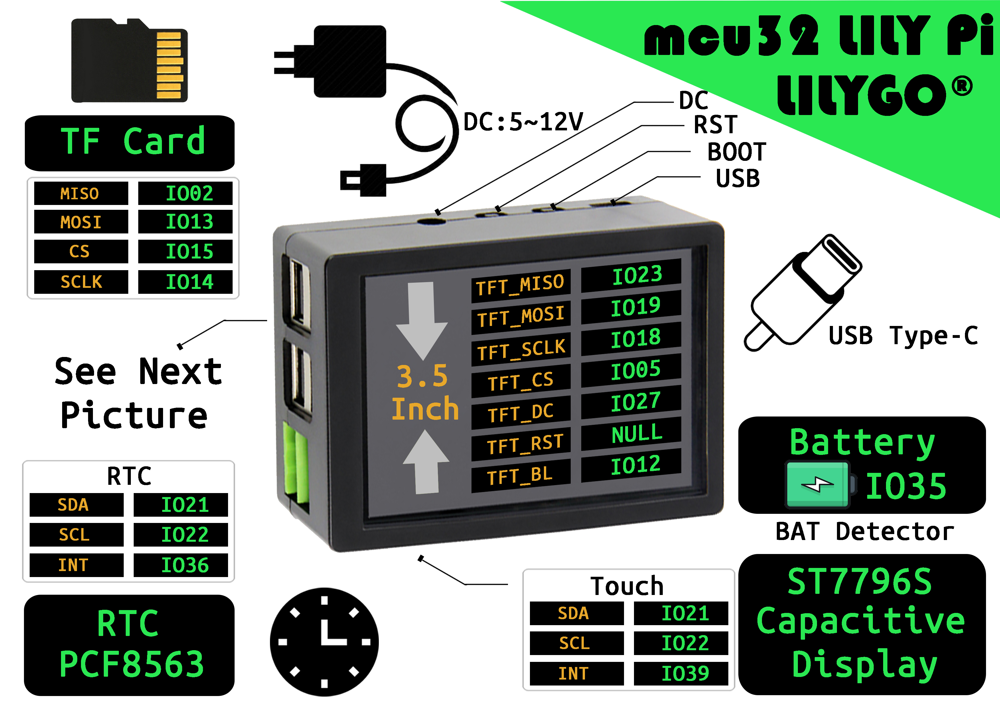
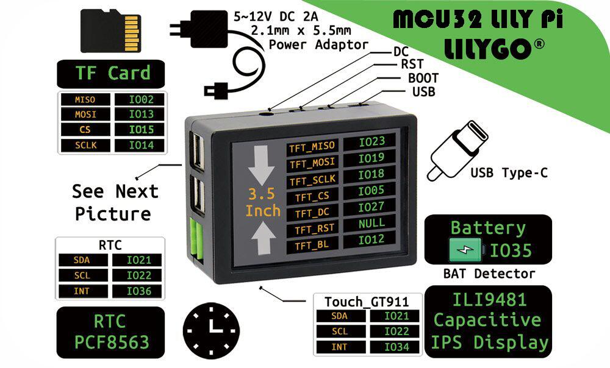
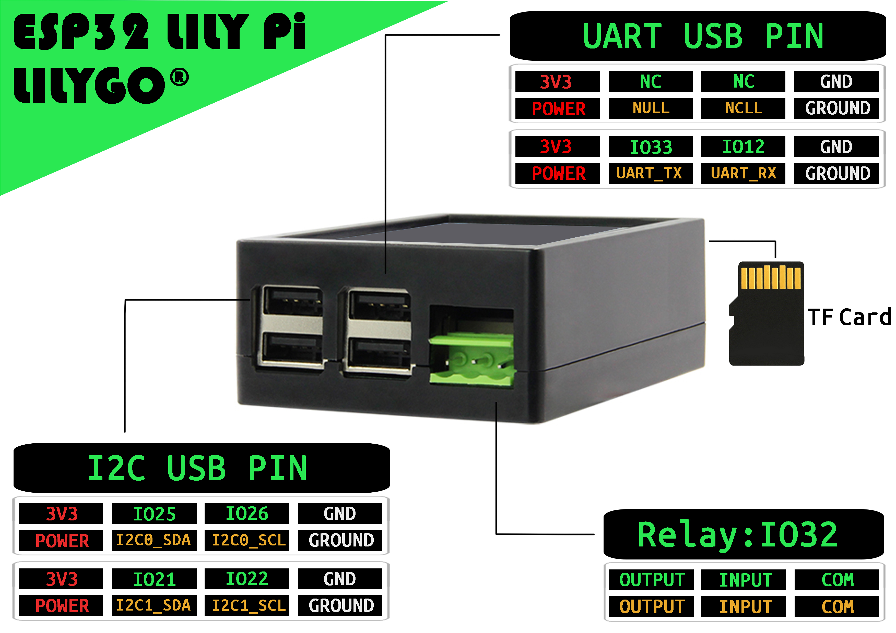

<h1 align = "center">🌟LILYGO LilyPi🌟</h1>

## **English | [中文](./README_CN.MD)**

<h3 align = "left">Quick start:</h3>

1. Install the current upstream Arduino IDE at the 1.8 level or later. The current version is at the [Arduino website](http://www.arduino.cc/en/main/software).
2. Start Arduino and open Preferences window. In additional board manager add url: https://raw.githubusercontent.com/espressif/arduino-esp32/gh-pages/package_esp32_index.json .separating them with commas.
3. Select Tools -> Board manager , Search esp32 , Select the version and install it
4. [Download a zipfile](https://github.com/Xinyuan-LilyGO/TTGO_TWatch_Library/archive/refs/heads/master.zip) from github using the "Download ZIP" button and install it using the IDE ("Sketch" -> "Include Library" -> "Add .ZIP Library...",  
5. Open the example.In the config.h file ，Select the correct macro definition based on the controller.(Use ST7796S or Use  ILI9841)
6. [Uploading factory Firmware](./firmware/README.MD)

<h3 align = "left">Product 📷:</h3>

| Product |                           Product  Link                            |
| :-----: | :----------------------------------------------------------------: |
| LilyPi  | [AliExpress](https://pt.aliexpress.com/item/1005001447548347.html) |

## Pinout

