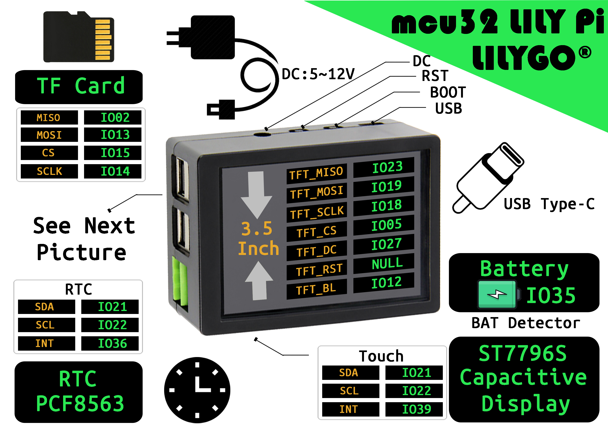
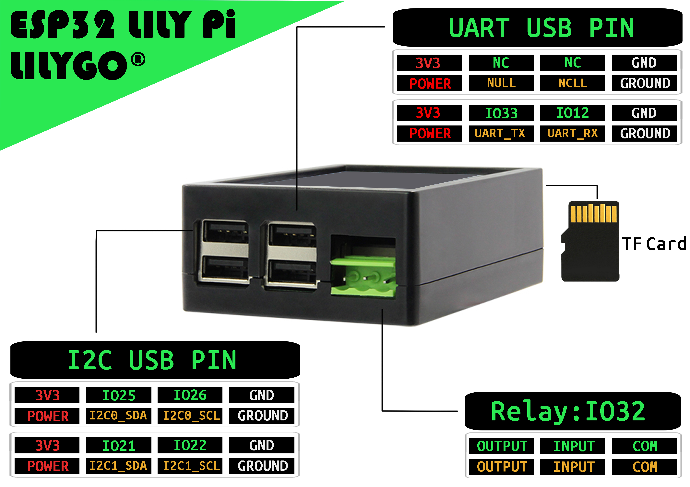

<h1 align = "center">🌟LILYGO LilyPi🌟</h1>

## **English | [中文](./README_CN.MD)**

<h3 align = "left">快速开始:</h3>

1. 安装1.8以上的[Arduino IDE](http://www.arduino.cc/en/main/software).
2. 打开Arduino IDE 在文件->首选项->附加开发板管理器网站添加 https://raw.githubusercontent.com/espressif/arduino-esp32/gh-pages/package_esp32_index.json .最后用以逗号隔开。(由于这个网站服务器在国外，可能比较慢或者不成功。也可以参考[LilyGo-Document](https://github.com/Xinyuan-LilyGO/LilyGo-Document)来搭建)
3. 选择"工具"->开发板管理器-> 搜索ESP32  ，选择版本并安装
4. 下载[TTGO_TWatch_Library](https://github.com/Xinyuan-LilyGO/TTGO_TWatch_Library/archive/refs/heads/master.zip),添加库（项目->加载库->添加.ZPI 库...，把下载的TTGO_TWatch_Library库添加）
5. 打开目录的example示例，在config.h文件中选择正确的宏 。（Use ST7796S 或者 Use ILI9841）
6. [出厂固件烧录](./firmware/README.MD)

<h3 align = "left">Product 📷:</h3>

| Product |                                               Product  Link                                                |
| :-----: | :--------------------------------------------------------------------------------------------------------: |
| LilyPi  | [淘宝](https://item.taobao.com/item.htm?spm=a1z10.3-c.w4002-23186215236.62.df12566dKqD5SD&id=626573236966) |

## Pinout

